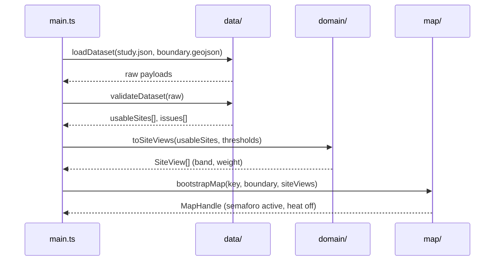
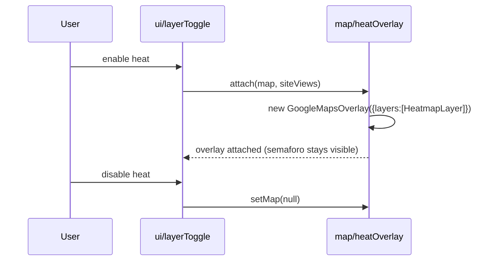

# Design: Chama Lichen Bioindicator Heatmap

## Technical Approach

Static Vite + TypeScript (vanilla) SPA with `base: './'`. Pure domain modules (validation, derivation) are separated from side-effecting modules (fetch, Google Maps, DOM) so all spec math is unit-testable without a browser. Boot sequence is fail-fast and always terminates in a visible state: map, empty state, or error state.

## Architecture Decisions

| Decision | Choice | Alternatives rejected | Rationale |
|---|---|---|---|
| Stack | Vite + TS vanilla | Vite+React; CDN scripts | UI is map + legend + one toggle; React adds no structure worth its cost (exploration A1) |
| Heat rendering | deck.gl `HeatmapLayer` via `GoogleMapsOverlay` | `google.maps.visualization.HeatmapLayer` | Native layer decommissioned May 2026 (spec: map-visualization) |
| Validation | Hand-written type guards accumulating issues | zod / all-or-nothing parse | Need per-site partial acceptance: drop invalid sites, keep the rest, report why |
| Derivation input | Consume `avgCoverByMorphology` as given | Recompute from per-tree data | Contract stores averages over lichen-bearing trees only; per-tree data is out of scope |
| Thresholds | Frozen config object injected into `deriveBand` | Inline literals | Spec allows tuning; injection makes threshold tests trivial |
| Tests | Vitest on pure modules | None; Playwright E2E | Repo has no runner (`strict_tdd: false`); Vitest is the minimum bar before TDD |

## Data Flow

```
main.ts
  ├─ readEnv()          ── missing key ──→ statusView.error('config')
  ├─ loadDataset()      ── fetch/parse fail ──→ statusView.error('data')
  ├─ validateDataset()  → { usableSites[], issues[] }
  │                     ── usableSites == 0 ──→ statusView.empty()
  ├─ toSiteViews()      → prevalence, avgCoverTotal, band, bandSource, heatWeight
  └─ bootstrapMap() → boundaryLayer + semaforoLayer (default) + legend + provisionalNotice
                        └─ layerToggle → heatOverlay (lazy)
```

### Sequence: dataset load



### Sequence: heat toggle



## Interfaces / Contracts

```ts
type Band = 'good' | 'moderate' | 'poor';
type Morphology = 'crustose' | 'foliose' | 'fruticose';

interface SiteMetrics { prevalence: number; avgCoverTotal: number; }
interface SiteView extends SiteMetrics {
  id: string; name: string; kind: 'park' | 'avenue' | 'other';
  location: { lat: number; lng: number };
  band: Band; bandSource: 'manual' | 'derived'; heatWeight: number;
}

interface BandThresholds {
  goodPrevalenceAtLeast: number;      // 0.70 — Alto
  moderatePrevalenceAtLeast: number;  // 0.40 — Medio (below good → Bajo)
}
```

### Derivation algorithm (`src/domain/derive.ts`)

Ficha técnica legend (incidencia only):

```ts
prevalence = treesWithLichen / treesExamined;          // treesExamined > 0 (validated)
avgCoverTotal = crustose + foliose + fruticose;        // optional; zeros when not measured

if (prevalence >= t.goodPrevalenceAtLeast) return 'good';       // Alto ≥70%
if (prevalence >= t.moderatePrevalenceAtLeast) return 'moderate'; // Medio ≥40%
return 'poor';                                                 // Bajo <40%
```

Reference: Benavides/Aviación 1/12 → poor; La Coruña 20/20 → good; Santos Chocano 4/6 → moderate.

**Cover semantics:** when provided, averages are over `treesWithLichen` only. Ficha técnica did not measure cover — dataset stores zeros; band ignores cover.

### Manual override (`src/domain/resolveBand.ts`)

`basis === 'manual'` and `airQualityBand` present → that band wins, `bandSource: 'manual'`. `basis === 'manual'` with no band → derive and record a warning issue. `basis === 'derived_from_lichen'` → always derive; any stored band is ignored.

### Heat weight

`heatWeight = prevalence` — incidencia drives heat when cover is not measured.

## Validation Rules (site is dropped, not fatal)

`treesExamined` integer > 0; `0 <= treesWithLichen <= treesExamined`; each cover in `[0,100]`; `treesWithLichen === 0` requires all covers 0; `dominantMorphology` required when `treesWithLichen > 0`; finite `lat`/`lng`. Missing `sampling` or `pollutionProxy` drops the site. Out-of-bbox coordinates warn only.

## File Changes

| File | Action | Description |
|---|---|---|
| `package.json`, `tsconfig.json`, `vite.config.ts` | Create | Vite+TS scaffold, `base: './'`, Vitest config |
| `index.html`, `src/styles.css` | Create | Shell markup, map container, status region |
| `.env.example`, `.gitignore`, `README.md` | Create | Key placeholder, ignore `.env`/`dist`, setup + key-restriction docs |
| `src/main.ts` | Create | Boot orchestration and state routing |
| `src/config/env.ts`, `src/config/thresholds.ts` | Create | Key read + fail-fast; thresholds and `heatWeight` |
| `src/data/types.ts`, `loadDataset.ts`, `validateDataset.ts` | Create | Contract types, fetch, per-site validation with issues |
| `src/domain/derive.ts`, `resolveBand.ts` | Create | Prevalence, `avgCoverTotal`, band, override |
| `src/map/bootstrap.ts`, `boundaryLayer.ts`, `semaforoLayer.ts`, `heatOverlay.ts` | Create | Maps loader, boundary polygon, semáforo markers, deck.gl overlay |
| `src/ui/legend.ts`, `provisionalNotice.ts`, `statusView.ts`, `layerToggle.ts` | Create | Legend, provisional label, empty/error states, heat toggle |
| `public/data/chama-study.json`, `chama-boundary.geojson` | Create | Provisional dataset; digitized Chama polygon |
| `src/**/*.test.ts` | Create | Unit tests colocated with pure modules |

## Testing Strategy

| Layer | What | Approach |
|---|---|---|
| Unit | prevalence, `avgCoverTotal`, band order, manual override, `heatWeight`, validation rejects | Vitest, table-driven; Benavides case as fixture |
| Integration | `loadDataset` + `validateDataset` against fixture JSON, including invalid and zero-usable payloads | Vitest with mocked `fetch` |
| Manual | `npm run build && npm run preview`: map, boundary, semáforo, legend, notice, heat toggle, missing-key error | Checklist in README; no Maps calls in CI |

## Security

Threat matrix: **N/A** — no routing, shell, subprocess, VCS/PR automation, executable-file classification, or process integration. All rows N/A for that reason.

Browser Maps keys are public by construction; restriction, not secrecy, is the control. Key read only from `import.meta.env.VITE_GOOGLE_MAPS_API_KEY`; `.env` gitignored, `.env.example` holds a placeholder; no live key in the repo or in fixtures. Deployment requires HTTP-referrer restriction to the exact deploy origin, API restriction to Maps JavaScript API only, and a quota/billing alert. Never IP restrictions for a browser key; never `__file_url__` referrers (`file://` is unsupported).

## Migration / Rollout

No migration — greenfield. Revert the branch to roll back.

## Open Questions

- [x] Chama boundary digitized (user GeoJSON) → `public/data/chama-boundary.geojson`.
- [x] Deploy origin for v1: localhost science fair (`vite` / `preview`); Maps key referrers = localhost ports.
- [ ] Deploy origin unknown, so the referrer restriction value stays documented rather than configured.
